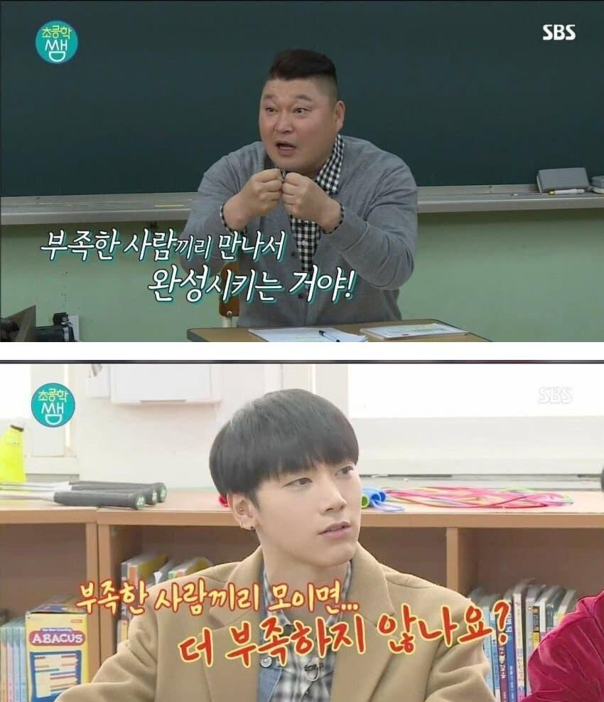
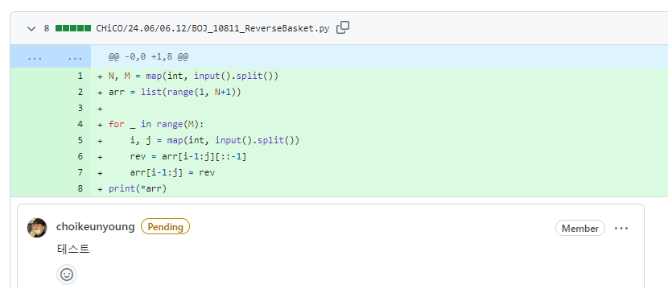
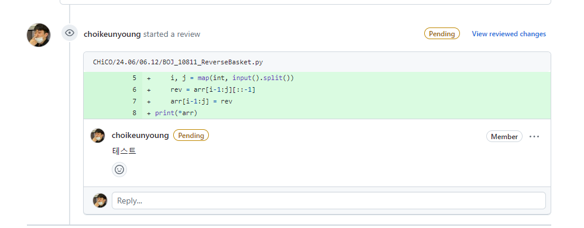

# 재활병동 204호

- 인원 : 김현지, 김동현, 최근영

## 코드 리뷰 방법

  
더보기

1. 들어간다

2. 커밋 버튼을 누른다

3. 리뷰할 커밋에 들어간다

4. 리뷰 혹은 궁금한 부분에 + 버튼을 눌러서 comment를 남긴다.

5. 메인으로 돌아오면 위와 같이 생성된 것을 볼 수 있다.

## 각자 하고싶은말

- 김현지 :

- 김동현 : 부족한 저와 함께 해주는 두 천사들께 항상 감사합니다. 항상 노력하고 발전하는 삶 살겠습니다.

- 최근영 :

## 스터디 진행 방식

### 1주일 정도 재활치료 느낌으로 하루에 5문제씩 해결 후 깃허브 올리고 서로 리뷰어로 지정하여 남의 코드를 보는 습관을 기른다.

## 스터디 규칙

- 이건 생각중

- 문제를 못 풀 수 있다고 생각하고 못풀었으면 어느 부분에서 생각이 막혔는지 어느 방식으로 시도를 했는지 등을 적어서 올리기

## 스터디 문제

  
2024-06-11

| 문제                                                | 김현지                                     | 김동현                                                  |
| --------------------------------------------------- | ------------------------------------------ | ------------------------------------------------------- |
| [알람 시계](https://www.acmicpc.net/problem/2884)   | [문제풀이](./MyeonJi/24.06/06.11/2884.py)  | [문제풀이](./CHiCO/24.06/06.11/BOJ_2884_AlarmClock.py)  |
| [별 찍기 - 2](https://www.acmicpc.net/problem/2439) | [문제풀이](./MyeonJi/24.06/06.11/2439.py)  | [문제풀이](./CHiCO/24.06/06.11/BOJ_2439_StarJJickgi.py) |
| [최댓값](https://www.acmicpc.net/problem/2562)      | [문제풀이](./MyeonJi/24.06/06.11/2562.py)  | [문제풀이](./CHiCO/24.06/06.11/BOJ_2562_MaxVal.py)      |
| [공 넣기](https://www.acmicpc.net/problem/10810)    | [문제풀이](./MyeonJi/24.06/06.11/10810.py) | [문제풀이](./CHiCO/24.06/06.11/BOJ_10810_BallPut.py)    |
| [단어의 개수](https://www.acmicpc.net/problem/1152) | [문제풀이](./MyeonJi/24.06/06.11/1152.py)  | [문제풀이](./CHiCO/24.06/06.11/BOJ_1152_HowMuchWord.py) |

  
2024-06-12

| 문제                                                      | 김현지                                     | 김동현                                                     |
| --------------------------------------------------------- | ------------------------------------------ | ---------------------------------------------------------- |
| [상수](https://www.acmicpc.net/problem/2908)              | [문제풀이](./MyeonJi/24.06/06.12/2908.py)  | [문제풀이](./CHiCO/24.06/06.12/BOJ_2908_sangsu.py)         |
| [그대로 출력하기2](https://www.acmicpc.net/problem/11718) | [문제풀이](./MyeonJi/24.06/06.12/11718.py) | [문제풀이](./CHiCO/24.06/06.12/BOJ_11718_gudaeroPrint.py)  |
| [바구니 뒤집기](https://www.acmicpc.net/problem/10811)    | [문제풀이](./MyeonJi/24.06/06.12/10811.py) | [문제풀이](./CHiCO/24.06/06.12/BOJ_10811_ReverseBasket.py) |
| [블랙잭](https://www.acmicpc.net/problem/2798)            | [문제풀이](./MyeonJi/24.06/06.12/2798.py)  | [문제풀이](./CHiCO/24.06/06.12/BOJ_2798_BlackJack.py)      |
| [커트 라인](https://www.acmicpc.net/problem/25305)        | [문제풀이](./MyeonJi/24.06/06.12/25305.py) | [문제풀이](./CHiCO/24.06/06.12/BOJ_25305_CutLine.py)       |

  
2024-06-13

| 문제                                                           | 김현지 | 김동현 |
| -------------------------------------------------------------- | ------ | ------ |
| [다이얼](https://www.acmicpc.net/problem/5622)                 | -      | -      |
| [수 정렬하기 3](https://www.acmicpc.net/problem/10989)         | -      | -      |
| [달팽이는 올라가고 싶다](https://www.acmicpc.net/problem/2869) | -      | -      |
| [세탁소 사장 동혁](https://www.acmicpc.net/problem/2720)       | -      | -      |
| [단어 공부](https://www.acmicpc.net/problem/1157)              | -      | -      |

  
2024-06-14

| 문제                                                      | 김현지 | 김동현 |
| --------------------------------------------------------- | ------ | ------ |
| [버그왕](https://www.acmicpc.net/problem/3447)            | -      | -      |
| [막대기](https://www.acmicpc.net/problem/17608)           | -      | -      |
| [소인수분해](https://www.acmicpc.net/problem/11653)       | -      | -      |
| [부녀회장이 될테야](https://www.acmicpc.net/problem/2775) | -      | -      |
| [캠핑](https://www.acmicpc.net/problem/4796)              | -      | -      |

