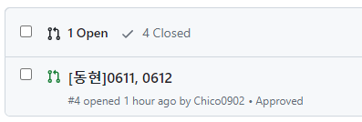
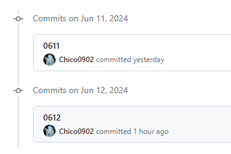

# 재활병동 204호

- 인원 : 김현지, 김동현, 최근영

## 코드 리뷰 방법

  
더보기

1. 들어간다

2. 커밋 버튼을 누른다

3. 리뷰할 커밋에 들어간다

4. 리뷰 혹은 궁금한 부분에 + 버튼을 눌러서 comment를 남긴다.

5. 메인으로 돌아오면 위와 같이 생성된 것을 볼 수 있다.

## 각자 하고싶은말

- 김현지 : 우리 꼭 마음속에 하고픈 말, 서로 서운했던 점을 제때 풀어내고 흩어지는 일 없도록 합시다.

- 김동현 : 부족한 저와 함께 해주는 두 천사들께 항상 감사합니다. 항상 노력하고 발전하는 삶 살겠습니다.

- 최근영 :

## 스터디 진행 방식

### 1주일 정도 재활치료 느낌으로 하루에 5문제씩 해결 후 깃허브 올리고 서로 리뷰어로 지정하여 남의 코드를 보는 습관을 기른다.

## 스터디 규칙

- 9 to 9 사이 문제를 풀지 않으면 지각비를 내게 될 거에요 야레야레 못말리는 취준생

- 문제를 못 풀 수 있다고 생각하고 못풀었으면 어느 부분에서 생각이 막혔는지 어느 방식으로 시도를 했는지 등을 적어서 올리기

- 승인받으면 브랜치 머지는 리뷰 확인 후 각자 직접하기

## 스터디 문제

  
2024-06-11

| 문제                                                | 김현지                                     | 김동현                                                  |
| --------------------------------------------------- | ------------------------------------------ | ------------------------------------------------------- |
| [알람 시계](https://www.acmicpc.net/problem/2884)   | [문제풀이](./MyeonJi/24.06/06.11/2884.py)  | [문제풀이](./CHiCO/24.06/06.11/BOJ_2884_AlarmClock.py)  |
| [별 찍기 - 2](https://www.acmicpc.net/problem/2439) | [문제풀이](./MyeonJi/24.06/06.11/2439.py)  | [문제풀이](./CHiCO/24.06/06.11/BOJ_2439_StarJJickgi.py) |
| [최댓값](https://www.acmicpc.net/problem/2562)      | [문제풀이](./MyeonJi/24.06/06.11/2562.py)  | [문제풀이](./CHiCO/24.06/06.11/BOJ_2562_MaxVal.py)      |
| [공 넣기](https://www.acmicpc.net/problem/10810)    | [문제풀이](./MyeonJi/24.06/06.11/10810.py) | [문제풀이](./CHiCO/24.06/06.11/BOJ_10810_BallPut.py)    |
| [단어의 개수](https://www.acmicpc.net/problem/1152) | [문제풀이](./MyeonJi/24.06/06.11/1152.py)  | [문제풀이](./CHiCO/24.06/06.11/BOJ_1152_HowMuchWord.py) |

  
2024-06-12

| 문제                                                      | 김현지                                     | 김동현                                                     |
| --------------------------------------------------------- | ------------------------------------------ | ---------------------------------------------------------- |
| [상수](https://www.acmicpc.net/problem/2908)              | [문제풀이](./MyeonJi/24.06/06.12/2908.py)  | [문제풀이](./CHiCO/24.06/06.12/BOJ_2908_sangsu.py)         |
| [그대로 출력하기2](https://www.acmicpc.net/problem/11718) | [문제풀이](./MyeonJi/24.06/06.12/11718.py) | [문제풀이](./CHiCO/24.06/06.12/BOJ_11718_gudaeroPrint.py)  |
| [바구니 뒤집기](https://www.acmicpc.net/problem/10811)    | [문제풀이](./MyeonJi/24.06/06.12/10811.py) | [문제풀이](./CHiCO/24.06/06.12/BOJ_10811_ReverseBasket.py) |
| [블랙잭](https://www.acmicpc.net/problem/2798)            | [문제풀이](./MyeonJi/24.06/06.12/2798.py)  | [문제풀이](./CHiCO/24.06/06.12/BOJ_2798_BlackJack.py)      |
| [커트 라인](https://www.acmicpc.net/problem/25305)        | [문제풀이](./MyeonJi/24.06/06.12/25305.py) | [문제풀이](./CHiCO/24.06/06.12/BOJ_25305_CutLine.py)       |

  
2024-06-13

| 문제                                                           | 김현지                                     | 김동현                                                     |
| -------------------------------------------------------------- | ------------------------------------------ | ---------------------------------------------------------- |
| [다이얼](https://www.acmicpc.net/problem/5622)                 | [문제풀이](./MyeonJi/24.06/06.13/5622.py)  | [문제풀이](./CHiCO/24.06/06.13/BOJ_5622_Dial.py)           |
| [수 정렬하기 3](https://www.acmicpc.net/problem/10989)         | [문제풀이](./MyeonJi/24.06/06.13/10989.py) | [문제풀이](./CHiCO/24.06/06.13/BOJ_10989_NumSort3.py)      |
| [달팽이는 올라가고 싶다](https://www.acmicpc.net/problem/2869) | [문제풀이](./MyeonJi/24.06/06.13/2869.py)  | [문제풀이](./CHiCO/24.06/06.13/BOJ_2869_SnailWantsGoUp.py) |
| [세탁소 사장 동혁](https://www.acmicpc.net/problem/2720)       | [문제풀이](./MyeonJi/24.06/06.13/2720.py)  | [문제풀이](./CHiCO/24.06/06.13/BOJ_2720_STXOwnerDH.py)     |
| [단어 공부](https://www.acmicpc.net/problem/1157)              | [문제풀이](./MyeonJi/24.06/06.13/1157.py)  | [문제풀이](./CHiCO/24.06/06.13/BOJ_1157_VocaStudy.py)      |

  
2024-06-14

| 문제                                                      | 김현지                                     | 김동현                                                          |
| --------------------------------------------------------- | ------------------------------------------ | --------------------------------------------------------------- |
| [버그왕](https://www.acmicpc.net/problem/3447)            | [문제풀이](./MyeonJi/24.06/06.14/3447.py)  | [문제풀이](./CHiCO/24.06/06.14/BOJ_3447_BugKing.py)             |
| [막대기](https://www.acmicpc.net/problem/17608)           | [문제풀이](./MyeonJi/24.06/06.14/17608.py) | [문제풀이](./CHiCO/24.06/06.14/BOJ_17608_Stick.py)              |
| [소인수분해](https://www.acmicpc.net/problem/11653)       | [문제풀이](./MyeonJi/24.06/06.14/11653.py) | [문제풀이](./CHiCO/24.06/06.14/BOJ_11653_PrimeFactorization.py) |
| [부녀회장이 될테야](https://www.acmicpc.net/problem/2775) | [문제풀이](./MyeonJi/24.06/06.14/2775.py)  | [문제풀이](./CHiCO/24.06/06.14/BOJ_2775_WannaBeBNHJ.py)         |
| [캠핑](https://www.acmicpc.net/problem/4796)              | [문제풀이](./MyeonJi/24.06/06.14/4796.py)  | [문제풀이](./CHiCO/24.06/06.14/BOJ_4796_Camping.py)             |

  
2024-06-15

| 문제                                                     | 김현지                                     | 김동현                                                   |
| -------------------------------------------------------- | ------------------------------------------ | -------------------------------------------------------- |
| [TV 크기](https://www.acmicpc.net/problem/1297)          | [문제풀이](./MyeonJi/24.06/06.15/1297.py)  | [문제풀이](./CHiCO/24.06/06.15/BOJ_1297_TVSize.py)       |
| [슈퍼 마리오](https://www.acmicpc.net/problem/2851)      | [문제풀이](./MyeonJi/24.06/06.15/2851.py)  | [문제풀이](./CHiCO/24.06/06.15/BOJ_2851_SuperMario.py)   |
| [단어순서 뒤집기](https://www.acmicpc.net/problem/12605) | [문제풀이](./MyeonJi/24.06/06.15/12605.py) | [문제풀이](./CHiCO/24.06/06.15/BOJ_12605_ReverseWord.py) |
| [카드 역배치](https://www.acmicpc.net/problem/10804)     | [문제풀이](./MyeonJi/24.06/06.15/10804.py) | [문제풀이](./CHiCO/24.06/06.15/BOJ_10804_CardReverse.py) |
| [팰린드롬수](https://www.acmicpc.net/problem/1259)       | [문제풀이](./MyeonJi/24.06/06.15/1259.py)  | [문제풀이](./CHiCO/24.06/06.15/BOJ_1259_Palindrome.py)   |

  
2024-06-17

| 문제                                                  | 김현지                                    | 김동현        | 최근영        |
| ----------------------------------------------------- | ----------------------------------------- | ------------- | ------------- |
| [평균은 넘겠지](https://www.acmicpc.net/problem/4344) | [문제풀이](./MyeonJi/24.06/06.17/4344.py) | [문제풀이](#) | [문제풀이](#) |
| [초콜릿 자르기](https://www.acmicpc.net/problem/2163) | [문제풀이](./MyeonJi/24.06/06.17/2163.py) | [문제풀이](#) | [문제풀이](#) |
| [완전제곱수](https://www.acmicpc.net/problem/1977)    | [문제풀이](./MyeonJi/24.06/06.17/1977.py) | [문제풀이](#) | [문제풀이](#) |
| [소수 단어](https://www.acmicpc.net/problem/2153)     | [문제풀이](./MyeonJi/24.06/06.17/2153.py) | [문제풀이](#) | [문제풀이](#) |
| [약수들의 합](https://www.acmicpc.net/problem/9506)   | [문제풀이](./MyeonJi/24.06/06.17/9506.py) | [문제풀이](#) | [문제풀이](#) |

  
2024-06-18

| 문제                                                | 김현지                                     | 김동현        | 최근영        |
| --------------------------------------------------- | ------------------------------------------ | ------------- | ------------- |
| [수열의 변화](https://www.acmicpc.net/problem/1551) | [문제풀이](./MyeonJi/24.06/06.18/1551.py)  | [문제풀이](#) | [문제풀이](#) |
| [컵홀더](https://www.acmicpc.net/problem/2810)      | [문제풀이](./MyeonJi/24.06/06.18/2810.py)  | [문제풀이](#) | [문제풀이](#) |
| [거스름돈](https://www.acmicpc.net/problem/14916)   | [문제풀이](./MyeonJi/24.06/06.18/14916.py) | [문제풀이](#) | [문제풀이](#) |
| [행렬 곱셈](https://www.acmicpc.net/problem/2740)   | [문제풀이](./MyeonJi/24.06/06.18/2740.py)  | [문제풀이](#) | [문제풀이](#) |
| [덩치](https://www.acmicpc.net/problem/7568)        | [문제풀이](./MyeonJi/24.06/06.18/7568.py)  | [문제풀이](#) | [문제풀이](#) |

  
2024-06-19

| 문제                                                  | 김현지        | 김동현        | 최근영        |
| ----------------------------------------------------- | ------------- | ------------- | ------------- |
| [국회의원 선거](https://www.acmicpc.net/problem/1417) | [문제풀이](#) | [문제풀이](#) | [문제풀이](#) |
| [덱](https://www.acmicpc.net/problem/10866)           | [문제풀이](#) | [문제풀이](#) | [문제풀이](#) |
| [좋은 단어](https://www.acmicpc.net/problem/3986)     | [문제풀이](#) | [문제풀이](#) | [문제풀이](#) |

